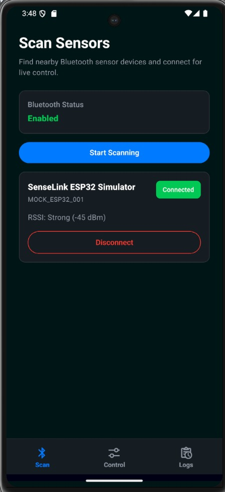
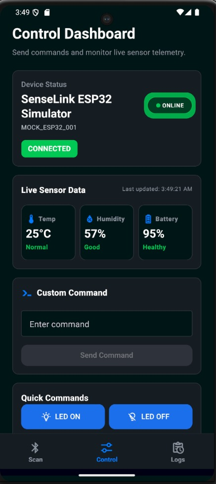
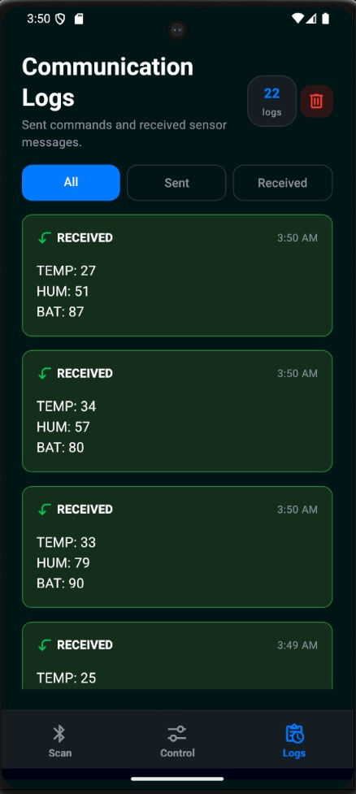

# 🚀 SenseLink

**IoT Bluetooth Sensor Controller**

SenseLink is a modern React Native mobile application designed for Bluetooth-enabled IoT devices. It provides real-time device monitoring, command execution, communication logs, and a clean dashboard experience.

---

## 📱 Screenshots

### Scan Screen
Discover and connect to nearby Bluetooth devices.

### Control Dashboard
Monitor sensor values and send commands.

### Communication Logs
Track all sent and received messages.

## 📱 App Screenshots

<p align="center">
  
  
  
</p>

---

## ✨ Features

### 📡 Bluetooth Device Scanning
- Scan nearby Bluetooth devices
- Display signal strength (RSSI)
- Connect and disconnect devices

### 🎛 Device Control
- Quick command actions
- Custom command support
- Real-time communication

### 📊 Live Sensor Monitoring
- Temperature monitoring
- Humidity monitoring
- Battery monitoring
- Live updates

### 📜 Communication Logs
- Sent messages history
- Received messages history
- Timestamp tracking
- Log filtering
- Clear logs support

### 🎨 Modern UI
- Dark IoT dashboard theme
- Responsive design
- Smooth navigation
- Clean user experience

---

## 🏗 Architecture

```text
UI Screens
     |
Bluetooth Context
     |
IBluetoothService
     |
-------------------------
|                       |
MockBluetoothService   BLEService
```

The application uses a service abstraction layer which allows switching between mock devices and real BLE devices without affecting the UI.

---

## 🛠 Tech Stack

### Frontend
- React Native CLI
- TypeScript
- React Navigation
- React Native Paper

### State Management
- React Context API

### Bluetooth
- react-native-ble-plx
- Mock Bluetooth Service

### Architecture
- Clean Architecture
- Service Layer Pattern
- Reusable Components

---

## 📂 Project Structure

```text
src/
│
├── components/
├── screens/
│   ├── Scan
│   ├── Control
│   └── Logs
│
├── context/
├── services/
│   ├── interfaces/
│   ├── BluetoothService
│   └── MockBluetoothService
│
├── navigation/
├── constants/
├── hooks/
└── utils/
```

---

## 🚀 Getting Started

### Install Dependencies

```bash
npm install
```

### Run Android

```bash
npx react-native run-android
```

### Start Metro

```bash
npx react-native start
```

---

## 📦 Version

### v1.0.0

Initial Release

Features included:

- BLE device scanning
- Device connection management
- Mock Bluetooth communication
- Real-time sensor monitoring
- Quick command controls
- Custom command support
- Communication logs
- Dark IoT dashboard UI
- Service abstraction architecture

---

## 🔮 Future Roadmap

### v1.1.0
- Real BLE device integration
- BLE simulator testing
- Settings screen
- Device information page

### v1.2.0
- Sensor charts
- CSV export
- Device history
- Auto reconnect

### v2.0.0
- ESP32 integration
- Cloud synchronization
- User authentication
- Multi-device support

---

## 👨‍💻 Developer

Developed using React Native CLI and TypeScript.

Built as a portfolio project showcasing:

- Bluetooth Communication
- IoT Application Design
- Real-Time Data Handling
- Mobile App Architecture
- Modern UI Development

---

## 📄 License

MIT License
